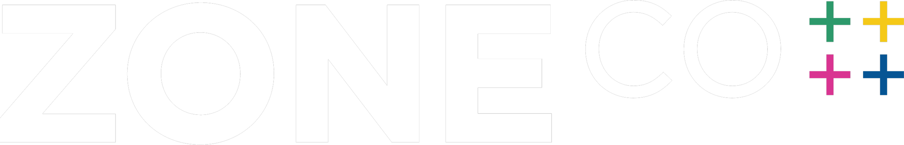

# ZoneCo website (v1 build, September 2, 2026; logo made swappable September 8, 2026)

Static site: 43 HTML pages, one stylesheet, one script, self-hosted fonts, images, hero video, and the document library. No build step is required to deploy; upload this folder as-is. New here? Read `START HERE - Sean.md` first.

## How changes get made (September 2026)

The site lives in the GitHub repository `azm1000/zoneco-website`. Netlify is linked to it: every change merged to `main` is live at the preview URL about ten seconds later, and every pull request gets its own Deploy Preview link. Nobody drags folders anymore.

- **Sean** opens [claude.ai/code](https://claude.ai/code), picks this repository, and describes the change in plain English. Claude makes it, opens a pull request with a preview link, and Sean clicks Merge when it looks right. Sean can also use `studio.html` on the live site to try logo/color ideas and send requests to Josh.
- **Josh** does the same, or works from a Claude session on his Mac.
- `CLAUDE.md` in this folder tells Claude how to behave in this repository; keep it current.

## Deploying

**Netlify (current).** Linked to the GitHub repo; pushes to `main` deploy automatically. (Drag-and-drop of this folder onto the Netlify Deploys page also still works as a manual fallback.) `netlify.toml` sets caching headers, `_redirects` maps every old Squarespace URL (e.g. `/aboutzoneco`, `/sean-s-suder`, `/s/*.pdf`) to its new page so inbound links and search rankings carry over, and the three forms (contact, training booking, newsletter) work automatically through Netlify Forms with no extra setup. Point the `thezoneco.com` DNS at Netlify when ready.

**Any other host (Cloudflare Pages, GitHub Pages, S3, a traditional web host).** Upload the folder. Recreate the redirects in `_redirects` using that host's redirect mechanism, and change the three `<form>` tags to post to a form service such as Formspree (replace `data-netlify="true"` with an `action` URL) or to your own handler.

The document library (`assets/docs/`, 21 PDFs the old site hosted) is included, so the PDF links on Resources and elsewhere resolve as-is.

## Structure

- `index.html` and the other page files sit at the root; every link is relative, so the site also opens directly from disk.
- `assets/css/site.css` is the whole design system (from the v7 mockup, plus inner-page components). Brand colors are CSS variables in the `:root` block near the top.
- `assets/js/site.js` handles the header, overlay menu, hero video rotation, map tooltips, count-ups, the portfolio search, and the news filters. `assets/js/map.js` is the zoomable map.
- `assets/img/` photos (team, projects, code pages, LinkedIn post images under `news/`), `assets/video/` the three hero clips, `assets/fonts/` Libre Franklin, `assets/docs/` every PDF the old site hosted.
- `brand-source/` raw logo files: what was pulled from thezoneco.com on 9/8/2026, plus anything ZoneCo adds (original vector logos, brand guide).
- `sitemap.xml` and `robots.txt` are generated.

## Changing the logo

The logo is a single file, `assets/img/logo.png`, referenced from every page as

```html
<a class="brand" href="index.html" aria-label="ZoneCo home"></a>   <!-- header -->
<div class="brand"></div>                                          <!-- footer -->
```

To change the logo everywhere, replace that file. Rules that keep it looking right:

1. **Dark backgrounds only.** The header sits over a dark gradient (and turns solid dark when the page scrolls) and the footer is solid `--ink` (#0E0F0D). Use the reversed / white version of the logo. A standard dark-on-light version will disappear.
2. **Format.** SVG is best (sharp at every size): name it `logo.svg`, put it in `assets/img/`, and change `logo.png` to `logo.svg` in the two lines above on all 43 pages (a find-and-replace across `*.html`). A large PNG with a transparent background is what is there now. Do not use JPG (no transparency).
3. **Size.** The logo is rendered at a fixed height set by `--logo-height` in `assets/css/site.css` (default 32px; width scales automatically). A wide wordmark with a tagline under it becomes unreadable at 32px, so either use a version without the tagline in the header or raise `--logo-height` (40px is the most the 72px-tall header comfortably takes). Trim empty margins from the image first; extra transparent padding makes the logo look smaller than it is.
4. **Browser-tab icon.** `assets/img/favicon.svg` is the tab icon, referenced from every page's `<head>`. Make a square version of the new mark (e.g. the four plus signs on a dark square) and replace that file too.
5. **Check** `index.html`, `about.html`, and `contact.html` in a browser after the swap, top and bottom of each page.

The current logo file is `assets/img/logo.png` (the ZONECO ++++ wordmark, white, trimmed, 2500 px wide). `assets/img/logo.svg` is the previous plat mark + "ZoneCo" lockup and `logo-lockup-*.{svg,png}` / `logo-mark.svg` are older exports of it; nothing links to them.

## Changing colors and fonts

**Cache note:** `netlify.toml` tells browsers to cache everything under `assets/` for a year. After any change to `site.css`, `site.js`, or `map.js`, bump the `?v=` query string on their `<link>`/`<script>` tags in all 43 pages (currently `?v=20260908`), or visitors keep the old file. Images with new content should get new file names for the same reason.

All colors are CSS variables at the top of `assets/css/site.css`:

| Variable | Value | Used for |
|---|---|---|
| `--ink` | #0E0F0D | near-black: header (scrolled), footer, dark sections, body text |
| `--ink-2` | #1A1B18 | secondary dark |
| `--paper` | #F5F4EF | page background, text on dark |
| `--paper-2` | #E9E7DF | secondary light |
| `--ochre` | #D9A21B | accent: menu button, highlights, HQ lot in the mark |
| `--slate` | #4D5F6E | residential lots in the mark, muted accents |
| `--sage` | #B9BDA9 | footer headings, commercial lots in the mark |
| `--brick` | #8E5A48 | mixed-use lots in the mark |
| `--mute` | #6B6E66 | secondary text |

Changing a value there changes it site-wide. The `.plat .lot.*` rules further down color the plat illustration on the home page and are unrelated to the logo. The typeface is Libre Franklin (self-hosted in `assets/fonts/`, declared in the `@font-face` blocks at the top of the stylesheet); to change it, add the new font files there and update `font-family` on `body`.

## Editing content

Each page is a plain HTML file. The header and footer are repeated verbatim in every file, so a change to either must be applied to all 43 pages (search-and-replace). Team bios, case studies, and service pages are self-contained. The where-we-work portfolio list and the news feed are embedded in `where-we-work.html` and `news.html`.

The Python generator that originally produced these files (`src/`, with `news_data.py` and `portfolio_data.py`) is not in this folder; edit the HTML directly.

## Known follow-ups

- The hero video clips are Mixkit stock (free license); swap in ZoneCo footage when available.
- Dates on LinkedIn-sourced news items are month-level.
- Logo swapped 9/8/2026 to the ZONECO ++++ wordmark (`assets/img/logo.png`, from the web version on thezoneco.com; favicon is the four plus signs). Replace `logo.png` with a vector export when ZoneCo supplies the original files (then rename references back to `.svg` or keep `.png`).
